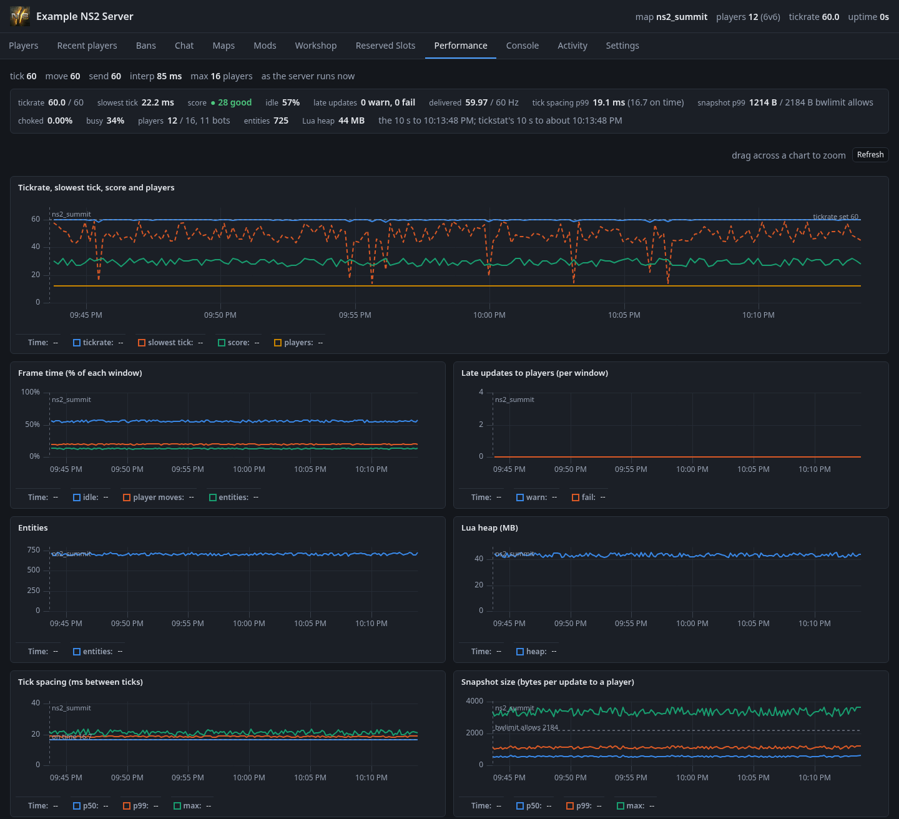
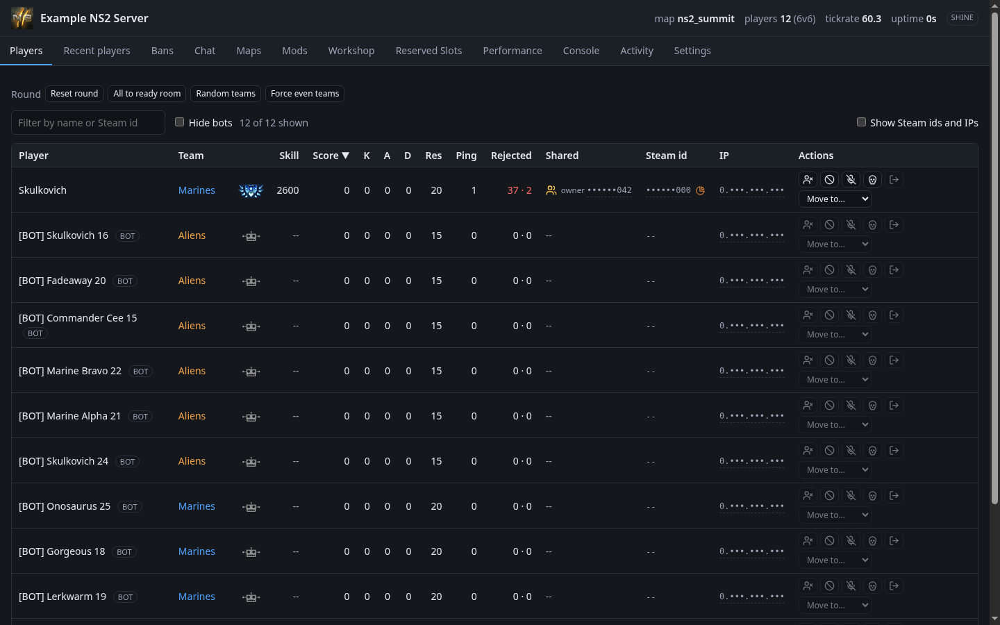
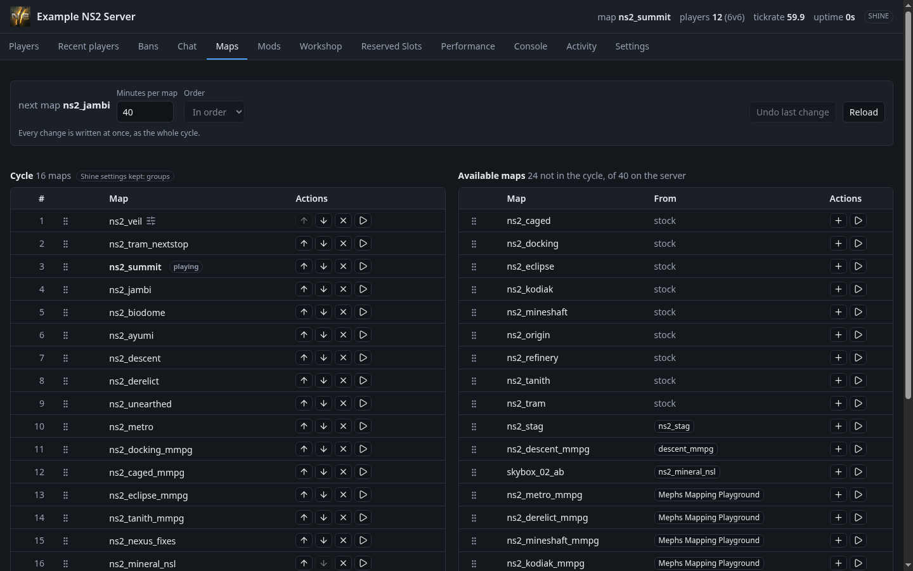
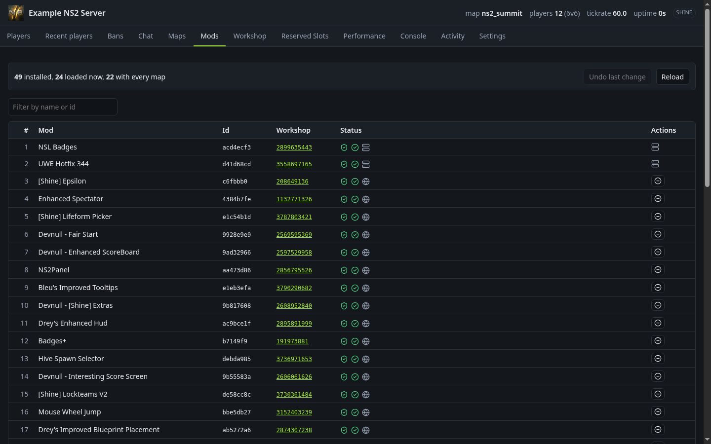
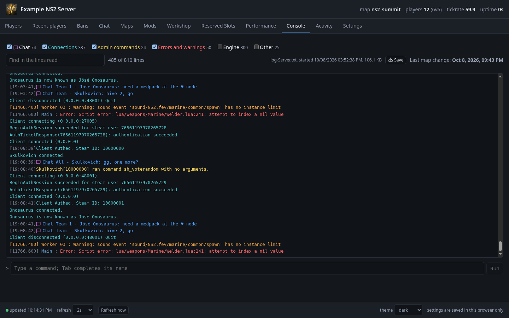

# NS2 Improved Web Admin

A modern replacement for the Natural Selection 2 dedicated server's web
admin panel, shipped as a **workshop mod**: a new front end plus a
corrected `ServerWebInterface.lua`, mounted together. No engine change and
no game-file edits.

> **Read this first.** This project was entirely vibe-coded: written by an
> AI coding assistant, directed and reviewed by a human. It is **still in
> development**: the Workshop item is an unlisted beta. It is
> provided **as is, with no warranty** of any kind. It runs Lua inside your
> game server and changes how that server handles bans, reserved slots and
> the map cycle. **Use it at your own risk**, test it on a server you can
> afford to break first, and keep backups of your config. Read
> [docs/SECURITY.md](docs/SECURITY.md) before you make the web admin
> reachable from anywhere but the server itself.

## Status

Version 0.1.0, an **unlisted** Workshop item:
[3816039702](https://steamcommunity.com/sharedfiles/filedetails/?id=3816039702)
(hex `e3742516`). It works on vanilla and Shine servers and covers every
action of the 2012 panel. Remaining work is in
[docs/DESIGN.md](docs/DESIGN.md#next).

## What's new over the 2012 panel

- Command output: see what each command printed
- The server log, live, with filters and the command line under it
- Recent players: ban someone who already left
- Performance from `perfmon` and the engine's `tickstat`
- Hive skill and skill badges
- Mods in mount order, with loaded state and ranked-whitelist check
- Workshop search with details before install
- Chat with times and team, and confirmed sends
- Map cycle editing that keeps Shine's options
- Shine support throughout
- Steam ids and IPs masked until asked
- Fixes for the stock Lua: reserved slots, unban, expired bans
- Nothing fetched from third parties
- Dark and light themes, settings kept in the browser

Details of each tab: [docs/DESIGN.md](docs/DESIGN.md#the-tabs).

## Installing

The server is unranked while the mod is mounted.

1. Add `e3742516` to `mods` in the server's `MapCycle.json`, then change
   map or restart.
2. Keep the server's log in its config directory: `-logdir` equal to
   `-config_path`, or neither flag. Otherwise the Console and part of
   Performance cannot read the log (and say so).
3. Open `/index.html` on the web admin port.

## Screenshots

Taken against the [mock server](mock/README.md); all data is made up.

**Performance**

**Players**

**Maps**

**Mods**

**Console**

## Documentation

| File | What it is |
| --- | --- |
| [docs/SECURITY.md](docs/SECURITY.md) | How to keep the web admin off the open internet: loopback, SSH tunnel, HTTPS proxy. |
| [docs/DESIGN.md](docs/DESIGN.md) | Scope, design decisions, what each tab does, what's next. |
| [docs/DEVELOPMENT.md](docs/DEVELOPMENT.md) | Layout, building, the gates, the tools. |
| [docs/REQUIREMENTS.md](docs/REQUIREMENTS.md) | What the replacement has to do, measured feasibility, what was built. |
| [docs/API.md](docs/API.md) | The web admin HTTP API, stock and with the mod ([openapi.yaml](docs/openapi.yaml)). |
| [docs/CURRENT-UI.md](docs/CURRENT-UI.md) | The 2012 panel: files, defects, where each action went. |
| [docs/CONSTRAINTS.md](docs/CONSTRAINTS.md) | The engine's rules, shipping as a mod, every Lua change and why, Shine, engine asks. |
| [docs/SERVER-COST.md](docs/SERVER-COST.md) | What the mod's Lua costs the server. |
| [docs/TESTING.md](docs/TESTING.md) | Testing on a local dedicated server. |
| [mock/README.md](mock/README.md) | The mock server used for development. |

## License

The project's own code is under the [MIT License](LICENSE). Some files keep
their owners' terms: the vanilla code in `lua/ServerWebInterface.lua`
(Unknown Worlds Entertainment), art from Natural Selection 2, and the
bundled libraries, whose notices ship in `web/THIRD-PARTY-LICENSES.txt`.
[LICENSE](LICENSE) lists them all.

Not affiliated with or endorsed by Unknown Worlds Entertainment or Valve.
